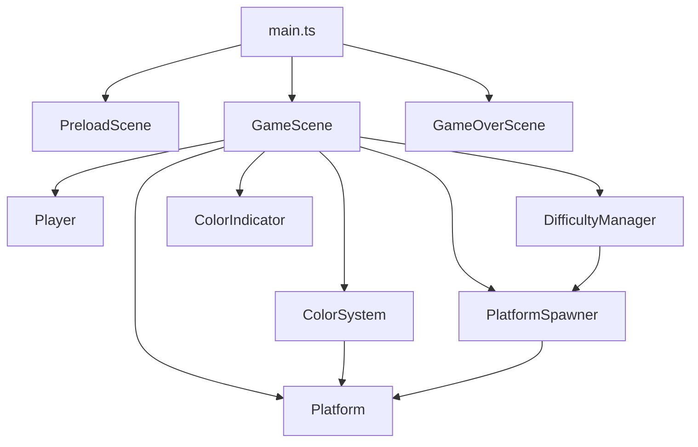
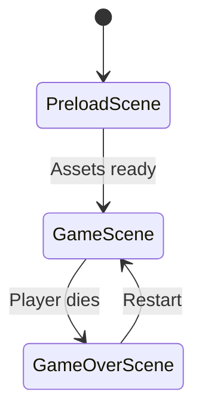

# System Architecture

Chromask is a vertical platformer built with Phaser 3 and TypeScript. The architecture follows a modular design separating concerns into scenes, entities, systems, and UI components. The core gameplay loop involves a player climbing platforms while managing color states that determine platform solidity through bitwise operations.

## Module Relationships



## Directory Structure

```
src/
├── main.ts              # Entry point, Phaser config
├── constants.ts         # All game constants
├── scenes/              # Phaser scenes
│   ├── PreloadScene.ts  # Asset generation
│   ├── GameScene.ts     # Main gameplay
│   └── GameOverScene.ts # Death screen
├── entities/            # Game objects
│   ├── Player.ts        # Player sprite with movement
│   └── Platform.ts      # Platform with color state
├── systems/             # Game logic systems
│   ├── ColorSystem.ts   # Color state management
│   ├── PlatformSpawner.ts # Platform generation
│   └── DifficultyManager.ts # Difficulty scaling
└── ui/                  # HUD components
    └── ColorIndicator.ts # RGB state display
```

## Scene Flow



## Data Flow

### Color State Management

The `ColorSystem` manages the active color state using bitwise operations defined in `constants.ts`:

- `GameColor` enum uses powers of 2 (RED=1, GREEN=2, BLUE=4)
- `setColors(red, green, blue)` combines active colors using bitwise OR
- `getActiveColor()` returns the combined bitmask
- `isColorActive(color)` checks if a specific color is active using bitwise AND

Example: When RED and BLUE are active, the active color is `1 | 4 = 5`.

### Platform Generation

The `PlatformSpawner` generates platforms dynamically:

1. `spawnPlatformsAbove()` is called when camera scrolls up
2. Platforms are positioned at intervals defined by `PLATFORM_CONSTANTS.VERTICAL_SPACING`
3. Color assignment uses `DifficultyManager` to determine complexity:
   - Early game: Single colors (RED, GREEN, or BLUE)
   - Mid game: Dual colors (RED|GREEN, RED|BLUE, GREEN|BLUE)
   - Late game: All three colors (RED|GREEN|BLUE)
4. `cullPlatformsBelow()` removes platforms below the camera view

### Collision Detection

Platform solidity is determined by color matching:

1. `GameScene` checks player-platform overlap each frame
2. For each platform, `ColorSystem.isColorActive(platform.color)` is evaluated
3. If colors match: `platform.setSolid(true)` enables collision
4. If colors don't match: `platform.setSolid(false)` disables collision, applies dashed border effect
5. Phaser's physics engine handles the actual collision response

This creates the core mechanic: players must activate the correct colors to land on platforms.

### Difficulty Scaling

The `DifficultyManager` tracks progress and adjusts gameplay:

- `getHeightClimbed()` returns distance traveled upward
- `getScrollSpeed()` increases camera speed based on height
- Platform color complexity increases at defined height thresholds
- Spawner uses difficulty level to select appropriate color combinations

## Key Design Decisions

### Bitwise Color Operations

Colors use bitwise flags (1, 2, 4) instead of enums or strings. This enables:
- Efficient color combination checks using bitwise AND
- Compact representation of multiple active colors
- Fast comparison operations in the game loop

See `SPEC.md` section 3.1 for detailed color mechanics.

### Programmatic Asset Generation

`PreloadScene` generates all textures at runtime using Phaser's graphics API:
- No external image files required
- Consistent visual style through code
- Easy color customization via constants

See `SPEC.md` section 4.1 for asset specifications.

### Scene-Based Architecture

Phaser's scene system provides clear separation:
- `PreloadScene`: One-time initialization
- `GameScene`: Core gameplay loop
- `GameOverScene`: End state with restart capability

Each scene is self-contained with its own lifecycle methods.

### System-Entity Separation

Game logic is separated from game objects:
- **Entities** (`Player`, `Platform`): Visual representation and basic behavior
- **Systems** (`ColorSystem`, `PlatformSpawner`, `DifficultyManager`): Game rules and state management

This separation improves testability and maintainability.

### Camera-Driven Gameplay

The camera scrolls upward continuously, driving the core loop:
- Player must climb to stay in view
- Falling below camera bounds triggers game over
- Scroll speed increases with height for difficulty scaling

See `SPEC.md` section 3.3 for camera behavior details.

## Performance Considerations

- Platform culling removes off-screen objects to maintain performance
- Color checks use bitwise operations for minimal overhead
- Texture generation happens once during preload
- Physics bodies are reused through Phaser's object pooling

## Extension Points

The architecture supports future enhancements:
- New systems can be added to `GameScene` without modifying entities
- Additional colors can be added by extending `GameColor` enum
- New platform types can inherit from base `Platform` class
- UI components can be added independently to scenes

For gameplay mechanics and feature details, refer to `SPEC.md`.
