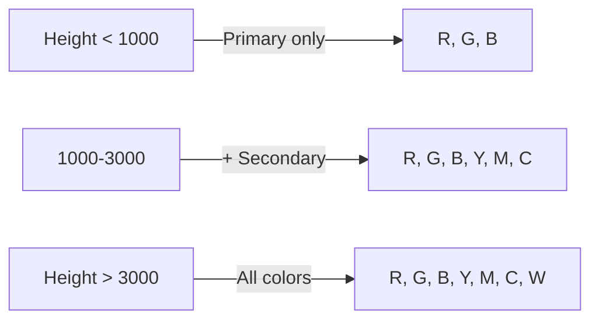

# Platform Spawning System

The platform spawning system generates an endless vertical sequence of platforms using procedural generation algorithms. Platforms are created dynamically as the player climbs, with difficulty and color variety increasing with height.

## Overview

The `PlatformSpawner` manages platform creation, positioning, and lifecycle. It spawns platforms ahead of the camera's view, adjusts difficulty based on height, and culls platforms that fall below the visible area to prevent memory leaks.

## Spawning Algorithm

Platforms are spawned when the highest platform is less than 800px (`CAMERA.SPAWN_AHEAD`) ahead of the camera's current position. The spawning process:

1. **Vertical Positioning**: New platforms are placed at a random vertical gap above the previous platform
   - Minimum gap: `MIN_GAP_Y` (60px)
   - Maximum gap: `currentMaxGapY` (ranges from 80px to 150px based on height)
   - Gap increases gradually as player climbs higher

2. **Horizontal Positioning**: Random X position within the playable zone
   - Constrained to keep platforms reachable
   - During easy phase: limited drift from previous platform (max 150px)

3. **Color Selection**: Platform color chosen from available colors based on current height (see Color Distribution below)

4. **Difficulty Scaling**: Gap sizes and color variety increase with height to create progressive challenge

## Playable Zone

The playable zone defines the horizontal boundaries where platforms can spawn:

- **Maximum Width**: 600px (centered on screen)
- **Platform Width**: Scales with screen size using formula:
  ```
  width = min(screenWidth / 480, 1.5) * 120
  ```
  - Base width: 120px
  - Scales up to 1.5x on larger screens
  - Ensures platforms remain proportional to screen size

Platforms are positioned to stay within this zone while maintaining gameplay challenge.

## Color Distribution

Platform colors unlock progressively as the player climbs higher, introducing new gameplay mechanics at different heights:



- **0-1000px**: Primary colors only (Red, Green, Blue)
- **1000-3000px**: Secondary colors added (Yellow, Magenta, Cyan)
- **3000px+**: All colors including White

This gradual introduction helps players learn color mechanics before facing full complexity.

## Easy Phase

The first 375px (`DIFFICULTY.EASY_PHASE_HEIGHT`) provides a gentler learning curve:

- **Color Consistency**: 70% chance to spawn the same color as the previous platform
  - Reduces color switching frequency for beginners
  - Allows players to learn basic jumping mechanics first

- **Smaller Gaps**: Maximum vertical gap limited to 70px
  - More forgiving jump distances
  - Easier to maintain momentum

- **Limited Horizontal Drift**: New platforms stay within 150px of previous platform's X position
  - Prevents extreme horizontal jumps
  - Keeps player centered on screen

After the easy phase, these constraints are removed and full difficulty scaling begins.

## Culling

Platforms are automatically destroyed when they fall more than 100px below the camera's bottom edge. This culling system:

- Prevents memory leaks from accumulating platforms
- Maintains consistent performance during long play sessions
- Removes platforms that are no longer visible or reachable

The culling threshold (100px below camera) provides a small buffer to prevent visible pop-out.

## Ground Platform

The first platform spawned at game start has special properties:

- **Position**: Bottom of the screen (y = screen height)
- **Color**: `NONE` (no color requirement)
- **Solidity**: Always solid via `alwaysSolid` flag
  - Player can always land on it regardless of active color
  - Provides guaranteed safe starting point

- **Width**: Full screen width
  - Ensures player cannot fall off at game start
  - Acts as the foundation for the climbing sequence

## Implementation Details

For detailed API documentation of the `PlatformSpawner` class, including methods and properties, see the [API Reference](../api-reference.md).

Key constants referenced:
- `PLATFORM.MIN_GAP_Y`: 60px
- `PLATFORM.MAX_GAP_Y`: 120px (base value, scales with height)
- `DIFFICULTY.EASY_PHASE_HEIGHT`: 375px
- `CAMERA.SPAWN_AHEAD`: 800px
